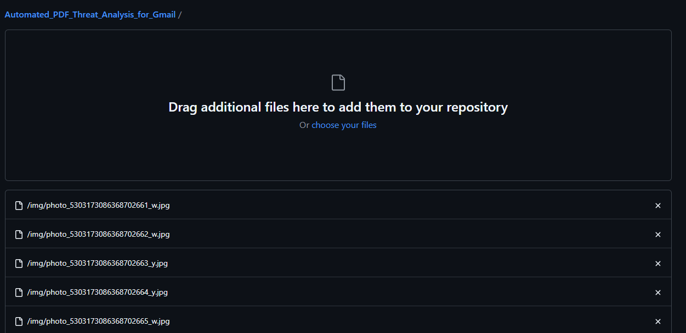
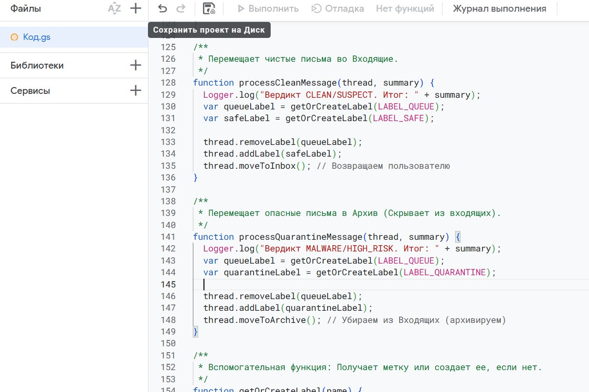
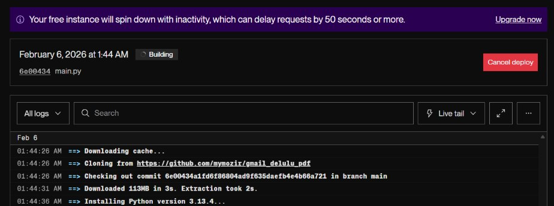

# Email Security Gateway Prototype

## About

This is an educational project that simulates an email attachment security gateway for Gmail.

The system automatically processes incoming emails with PDF attachments, analyzes them using a rule-based detection pipeline, and applies AI-assisted verification when necessary. Based on the analysis result, each message is classified as:

- CLEAN
- VERIFY
- MALWARE

The project was created to explore practical concepts of email security, automated threat detection, and decision-making pipelines.



*Figure 1 — General view of the system interface*

---

## Features

- Automatic processing of Gmail messages with PDF attachments via Google Apps Script
- Static analysis of PDF files at the byte and structure level
- Detection of potentially dangerous PDF features:
  - JavaScript execution
  - OpenAction
  - Additional Actions (AA)
  - Launch actions
  - SubmitForm / ImportData operations

- URL analysis:
  - URL shorteners (e.g., bit.ly, tinyurl)
  - IP-based URLs
  - Punycode domains
  - Suspicious use of `@` in URLs

- Rule-based classification system:
  - CLEAN
  - VERIFY
  - MALWARE



*Figure 2 — Email routing through labels*

- AI-assisted verification for ambiguous cases (VERIFY stage only)

- Gmail labeling and routing system:
  - `_SAFE`
  - `_VERIFY`
  - `_QUARANTINE`

- Protection against duplicate processing and forwarding loops
- Structured reporting of analysis results

---

## Architecture

The system consists of two main components:

- Google Apps Script (Gmail automation layer)
- Backend analysis service (PDF parsing + rule engine + AI verification)



*Figure 3 — Backend hosted on Render*

---

## Workflow

```text
Incoming Gmail message
        │
        ▼
Google Apps Script trigger
        │
        ▼
Extract PDF attachment
        │
        ▼
Backend analysis request
        │
 ┌───────────────┐
 │               │
 ▼               ▼
Rule-based checks   AI verification (only if needed)
 │
 ▼
Final classification:
CLEAN / VERIFY / MALWARE
 │
 ▼
Apply Gmail labels and routing
